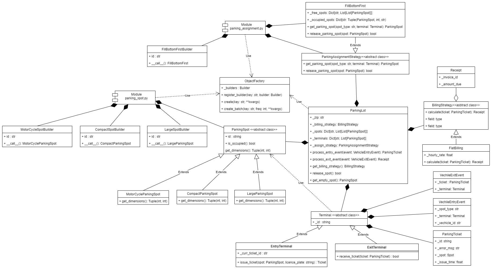

# Design a parking lot system

## What type of question is this?

* Do you want me to come up with a system design, or class diagram/hierarchy or just write methods class etch

## Clarify requirements/Scope

* How is the parking lot designed? Is it an open space? Is there an accessibility requirements? (i.e are some parking lots only available after the other ones get filled)

    Assume for now it is open space and no order to park the car

* How many spots are we talking about? (In case you are doing system design)?

    Assume for now that we have 1000 spots etc.

* Does each parking lot have a unique number ?

    Yes

* Do we have multiple types of spots or just one?

    let say for now you have three types of spots. Large, medium and small

* Do we have one level or multiple

    Yes you have multiple levels

* How many entry and exits do the lot have ?

    For now lets say we have 1 entries and 1 exits. (follow-up how do you design for more entries and exits?
    Concurrency issues?)

* How are we charging for the parking? Is it a flat rate for all types based on per hour rate or are
the costs different for different type of spot?

    Charge flat rate of $5 per hour for now

* What is the pricing strategy? Do we allow cash, creditcards etc.?

    You can pay wit either credit card or cash

* Do we allow small vehicle to park on medium or large spot?

    yes small(motorcycle) size can be parked in medium or large if small is not available.  Medium(car) can be parked
    in large spot but large(Bus) can only be parked in large spot

* Any premium parking spots (for example handicaps, or reserved etc)?

    For now no.

* What happens if no spots available a vehicle?

    Send it back

## determine use cases

* vehicles enters. If parking spot available, goes to that. We assign the parking_spot_id to this vehicle_id(licence plate).
Mark the spot occupied. Mark a start time to the vehicle

* vehicle leaves. We charge it based on the (current time - reserved time) * rate. We mark the spot unoccupied. Unlink the
vehicle from that spot.

## identify key objects/classes

* Vehicle(Abstract class/interface)

    Extended by Motorcycle, Car, Bus

* ParkingSpot(Abstract class/interface)

    Extended by SmallSpot, MediumSpot, LargeSpot

* ParkingLot

    The main class. We can use zip code to identify a parking lot in case we have multiple one

* ParkingStrategy(interface)

    FirstComeParkingStrategy. (no restriction except for the size as discussed above)
    NearestParkingStrategy. (park to the spot that is nearest)

* Payment

## Class diagram

